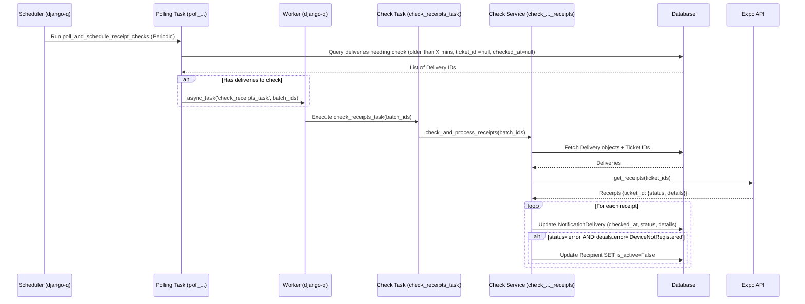

# Push Notification System Documentation

This document describes the push notification system implemented in the `kam-mobile-api` backend, utilizing Expo Push Notifications via the `expo-server-sdk-python` library and background task processing with `django-q2`.

## 1. System Architecture Overview

The system allows administrators to send push notifications to users of the mobile application. It handles token registration, notification creation, scheduled sending, communication with Expo, processing delivery receipts, and provides endpoints for users to view their notifications and manage read status.

```mermaid
graph TD
    A[Mobile App User] -- 1. Login --> B(Backend API);
    B -- 2. Get ExpoPushToken --> A;
    A -- 3. Send Token --> C[/api/notifications/register-token/];
    C -- 4. Store/Update Token --> D[(Database)];
  
    subgraph Admin Actions
        E[Admin User] -- 5. Create/Edit Notification --> F{Django Admin};
        F -- 6. Save Draft --> D;
        F -- 7. Queue/Schedule Action --> G(django-q2 Queue);
    end

    subgraph Background Processing
        H(django-q2 Worker) -- 8. Polls Queue/Schedule --> G;
        H -- 9. Executes send_notification Task --> I(Expo Push Service);
        I -- 10. Sends Notification --> J[User Device];
        I -- 11. Returns Push Tickets --> H;
        H -- 12. Stores Tickets --> K[NotificationDelivery Table];
      
        L(django-q2 Worker - Periodic) -- 13. Runs poll_and_schedule_receipt_checks --> D;
        L -- 14. Finds Deliveries needing Check --> D;
        L -- 15. Queues check_receipts_task --> G;
        H -- 16. Executes check_receipts_task --> I;
        I -- 17. Returns Receipts --> H;
        H -- 18. Updates Delivery Status based on Receipt --> K;
        H -- 19. Deactivates Invalid Recipients --> M[Recipient Table];
    end

    subgraph User Actions
        A -- 20. Fetch Notifications --> N[/api/notifications/my-notifications/];
        N -- 21. Query Deliveries --> K;
        K -- 22. Return Notification List --> N;
        N -- 23. Send List to App --> A;
        A -- 24. Mark Notification Read --> O[/api/notifications/deliveries/<uuid:delivery_pk>/mark-read/];
        O -- 25. Update read_at --> K;
        K -- 26. Success --> O;
        O -- 27. Success --> A;
        A -- 28. Fetch Unread Count --> P[/api/notifications/unread-count/];
        P -- 29. Count Unread --> K;
        K -- 30. Return Count --> P;
        P -- 31. Send Count --> A;
    end

    style Admin Actions fill:#f9f,stroke:#333,stroke-width:2px
    style Background Processing fill:#ccf,stroke:#333,stroke-width:2px
    style User Actions fill:#cfc,stroke:#333,stroke-width:2px
```



**Flow Description:**

1. **Token Registration:** When a user logs into the mobile app, the app retrieves an `ExpoPushToken` and sends it to the backend API (`/api/notifications/register-token/`). The backend stores this token, associating it with the authenticated user in the `Recipient` table.
2. **Notification Creation & Triggering:** An administrator uses the Django Admin interface to create a `Notification` (title, body, target audience). They can optionally set a `scheduled_at` time. Using a custom admin action ("Queue or Schedule..."), the notification is processed:
   * If `scheduled_at` is in the future, a `django-q` scheduled task is created to run `send_notification` at that time, and the status becomes `Scheduled`.
   * Otherwise, an immediate `django-q` task is created for `send_notification`, and the status becomes `Queued`.
3. **Sending:** A running `django-q` worker picks up `Queued` tasks immediately or `Scheduled` tasks at their designated time. It executes the `notifications.services.send_notification` function. This function:
   * Fetches notification details and active recipient tokens.
   * Uses the `expo-server-sdk-python` to send push messages to the Expo Push Service.
   * Receives push tickets back from Expo.
   * Creates `NotificationDelivery` records, storing the ticket ID and initial status ('sent' or 'error').
   * Updates the main `Notification` status to `Sent` or `Failed`.
4. **Receipt Checking (Periodic):** A separate, periodically scheduled `django-q` task (`poll_and_schedule_receipt_checks`) runs (e.g., every 15 minutes):
   * It finds `NotificationDelivery` records that were marked as `Sent` (have a ticket ID) but haven't had their receipts checked yet and are older than a defined delay (e.g., 15 mins).
   * It queues `check_receipts_task` jobs in batches for these deliveries.
   * The `django-q` worker picks up these tasks, which call `check_and_process_receipts`.
   * This service function queries the Expo `get_receipts` endpoint with the ticket IDs.
   * It updates the `NotificationDelivery` records with the final receipt status (`ok` or `error`) and details.
   * Crucially, if a receipt indicates `DeviceNotRegistered`, the corresponding `Recipient` is marked as inactive (`is_active = False`) to prevent future attempts.
5. **User Viewing Notifications:**
   * The mobile app calls `GET /api/notifications/my-notifications/` to fetch a list of successfully delivered notifications for the user.
   * The backend queries the `NotificationDelivery` table, filtering for the user and successful sends, and returns relevant details (including read status).
6. **Marking as Read:**
   * When the user interacts with a notification in the app, the app calls `POST /api/notifications/deliveries/{delivery_id}/mark-read/`.
   * The backend verifies ownership and updates the `read_at` timestamp for that specific `NotificationDelivery` record.
7. **Unread Count:**
   * The app calls `GET /api/notifications/unread-count/` to get the number of unread notifications.
   * The backend counts `NotificationDelivery` records for the user that were successfully sent and have `read_at` as null.

## 2. Database Models (`notifications/models.py`)

* **`Recipient`:**
  * Stores the association between a `CustomUser` and their `expo_push_token`.
  * `user`: ForeignKey to `settings.AUTH_USER_MODEL`.
  * `expo_push_token`: The unique token string from Expo.
  * `is_active`: Boolean, set to `False` if a `DeviceNotRegistered` error occurs, preventing further sends to this token.
* **`Notification`:**
  * Represents a notification created by an admin.
  * `title`, `body`, `data` (JSON): Content of the notification.
  * `target_type`: Choice (`all` or `specific`).
  * `target_users`: ManyToManyField to `CustomUser` (used if `target_type` is `specific`).
  * `status`: Choice (`draft`, `queued`, `scheduled`, `sending`, `sent`, `failed`). Tracks the notification's lifecycle.
  * `creator`: ForeignKey to `CustomUser` (the admin who created it).
  * `scheduled_at`: Optional DateTime to send the notification later.
  * `sent_at`: DateTime when the sending process began.
* **`NotificationDelivery`:**
  * Tracks the status of sending a specific `Notification` to a specific `Recipient`.
  * `notification`: ForeignKey to `Notification`.
  * `recipient`: ForeignKey to `Recipient`.
  * `push_ticket_id`: The ID received from Expo after the initial send attempt. Used to query for receipts.
  * `status`: Choice (`pending`, `sent`, `error`). Initial status after sending.
  * `receipt_checked_at`: DateTime when the receipt was checked.
  * `receipt_status`: Status from the Expo receipt (`ok` or `error`).
  * `receipt_details`: JSON containing error details from the Expo receipt (e.g., `{"error": "DeviceNotRegistered"}`).
  * `read_at`: DateTimeField (nullable). Stores the timestamp when the specific user associated with this delivery record marked the notification as read via the API. Null indicates unread.

## 3. API Endpoints (`notifications/urls.py`)

### Admin/System Endpoints

* **Register Push Token:**
  * **Path:** `/api/notifications/register-token/`
  * **Method:** `POST`
  * **Authentication:** Required (Token Authentication).
  * **Description:** Called by the mobile app after login to register or update the user's Expo push token.
  * **Request Body:** `{"expo_push_token": "ExponentPushToken[...]"]}`
  * **Success Response:** `200 OK` or `201 Created` with `{"success": true, "message": "..."}`
  * **Error Responses:** 400, 401, 409, 500.

### User-Facing Endpoints

* **List User Notifications:**
  * **Path:** `/api/notifications/my-notifications/`
  * **Method:** `GET`
  * **Authentication:** Required (Token Authentication).
  * **Description:** Retrieves a paginated list of notifications delivered to the authenticated user. Only includes notifications successfully handed off to Expo (based on delivery status/receipts).
  * **Query Params:** `?page=<number>` for pagination.
  * **Success Response (200 OK):** Paginated response (e.g., DRF `PageNumberPagination` format) containing a list of serialized `NotificationDelivery` objects. Each object includes:
    ```json
    {
        "id": "<delivery-uuid>",
        "read_at": "<iso-timestamp>" | null,
        "is_read": true | false,
        "notification": {
            "id": "<notification-uuid>",
            "title": "...",
            "body": "...",
            "data": { ... },
            "created_at": "<iso-timestamp>",
            "sent_at": "<iso-timestamp>" | null
        }
    }
    ```
  * **Error Responses:** 401, 500.
* **Mark Notification as Read:**
  * **Path:** `/api/notifications/deliveries/<uuid:delivery_pk>/mark-read/`
  * **Method:** `POST`
  * **Authentication:** Required (Token Authentication).
  * **Description:** Marks a specific notification delivery (identified by `delivery_pk`) as read for the authenticated user. Checks ownership.
  * **Request Body:** Empty.
  * **Success Response (200 OK):** `{"success": true, "message": "Notification marked as read."}` (Returns success even if already read).
  * **Error Responses:** 401, 404 (Not Found or not owned by user), 500.
* **Get Unread Notification Count:**
  * **Path:** `/api/notifications/unread-count/`
  * **Method:** `GET`
  * **Authentication:** Required (Token Authentication).
  * **Description:** Returns the number of successfully delivered notifications that the authenticated user has not yet marked as read.
  * **Success Response (200 OK):** `{"success": true, "unread_count": <number>}`
  * **Error Responses:** 401, 500.

## 4. Admin Interface (`notifications/admin.py`)

Administrators manage notifications via the standard Django Admin interface.

* **Recipients:** View registered users and their tokens. Can manually mark recipients as active/inactive.
* **Notifications:**
  * **Creating:** Add a new notification, setting Title, Body, optional Data (JSON), Target Type, and optionally Target Users and a Scheduled At time. Notifications are saved as 'Draft' initially.
  * **Queuing/Scheduling:** Select one or more 'Draft' notifications from the list view. Choose the "Queue or Schedule selected draft notifications" action.
    * If `scheduled_at` is in the future, the notification status becomes 'Scheduled', and a `django-q` schedule is created.
    * Otherwise, the status becomes 'Queued', and an immediate `django-q` task is created.
  * **Viewing Status:** The notification list and detail views show the current `status`. The detail view also includes an inline section showing the `NotificationDelivery` status for each targeted recipient after sending attempts.
* **Django Q:** The admin interface also includes sections provided by `django-q` ("Django_Q") to:
  * **View Scheduled Tasks:** See the periodic task created for polling receipts (`poll_and_schedule_receipt_checks`) and any one-off notification tasks scheduled for the future.
  * **View Queued/Failed Tasks:** Monitor the status of tasks being processed by the workers.

## 5. Background Task Processing (`django-q2`)

* **Sending (`notifications.services.send_notification`):** Triggered by the admin action via `async_task` (for immediate sends) or `schedule` (for future sends). Handles communication with the Expo API using `expo-server-sdk-python` and creates initial `NotificationDelivery` records.
* **Receipt Checking (`notifications.tasks.poll_and_schedule_receipt_checks`, `notifications.tasks.check_receipts_task`, `notifications.services.check_and_process_receipts`):**
  1. `poll_and_schedule_receipt_checks` is run periodically (defined by a `Schedule` object, typically created via the admin).
  2. It queries for `NotificationDelivery` records needing checks (sent > X minutes ago, have ticket ID, not yet checked).
  3. It queues `check_receipts_task` jobs in batches using `async_task`.
  4. `check_receipts_task` calls `check_and_process_receipts`.
  5. `check_and_process_receipts` uses the `expo-server-sdk-python`'s `get_receipts` method.
  6. It updates `NotificationDelivery` records with receipt status/details.
  7. It deactivates `Recipient` records if `DeviceNotRegistered` is found.



## 6. Deployment (Dokku)

Deploying the application with `django-q2` on Dokku requires ensuring the background worker process runs correctly.

1. **`requirements.txt`:** Ensure `django-q2` and `expo-server-sdk-python` are included.
   ```
   # requirements.txt (partial)
   Django==5.0.6
   django-q2==1.7.6
   expo-server-sdk-python==1.0.1
   gunicorn==...
   psycopg2-binary==... # Or your database adapter
   ...
   ```
2. **`Procfile`:** Define both the `web` process (for Django/Gunicorn) and the `worker` process (for `django-q`).
   ```Procfile
   web: gunicorn core.wsgi --log-file -
   worker: python manage.py qcluster
   ```
3. **Deployment:** Push your code to Dokku:
   ```bash
   git push dokku main
   ```
4. **Run Migrations:** After deployment, ensure database migrations (including those for `django-q`) are applied in the Dokku container:
   ```bash
   dokku run <your-app-name> python manage.py migrate
   ```

   *(Replace `<your-app-name>` with your actual Dokku app name)*.
5. **Scale the Worker:** Tell Dokku to start and maintain the `django-q` worker process defined in the `Procfile`:
   ```bash
   dokku ps:scale <your-app-name> worker=1
   ```

   You can adjust the number `1` if you need more worker processes based on load, but start with one.
6. **Monitor Worker Logs:** Check that the worker starts correctly and is processing tasks:
   ```bash
   dokku logs <your-app-name> -t -p worker
   ```
7. **Create Periodic Schedule (Post-Deployment):** **Crucially**, after deploying and ensuring the worker runs, you **must** log in to the **production Django Admin interface** and create the periodic `Schedule` for the `notifications.tasks.poll_and_schedule_receipt_checks` function, just like you did in development. This ensures receipt checking happens automatically in production.
   * **Login:** Access `/admin` on your production site.
   * **Navigate:** Go to the "DJANGO_Q" section -> "Scheduled tasks".
   * **Add:** Click "Add scheduled task".
   * **Configure:**
     * **Name:** `Poll for Notification Receipts` (or similar)
     * **Func:** `notifications.tasks.poll_and_schedule_receipt_checks`
     * **Hook:** (Leave blank)
     * **Args / Kwargs:** (Leave blank)
     * **Schedule Type:** `Minutes`
     * **Minutes:** `15` (or `30`, or your desired interval)
     * **Repeats:** `-1` (for infinite repeats)
     * **Next Run:** Set to the current time or slightly in the future (e.g., `YYYY-MM-DD HH:MM:SS`).
   * **Save** the schedule.

## 7. Potential Future Enhancements

* More granular error handling and retry logic for sending/receipt checking.
* Allow admins to view detailed delivery status per user in the admin, including read status.
* Support for notification categories/channels.
* User preferences for notification types.
* Marking multiple notifications as read in one API call.
* Deleting notifications from the user's view (soft delete?).
